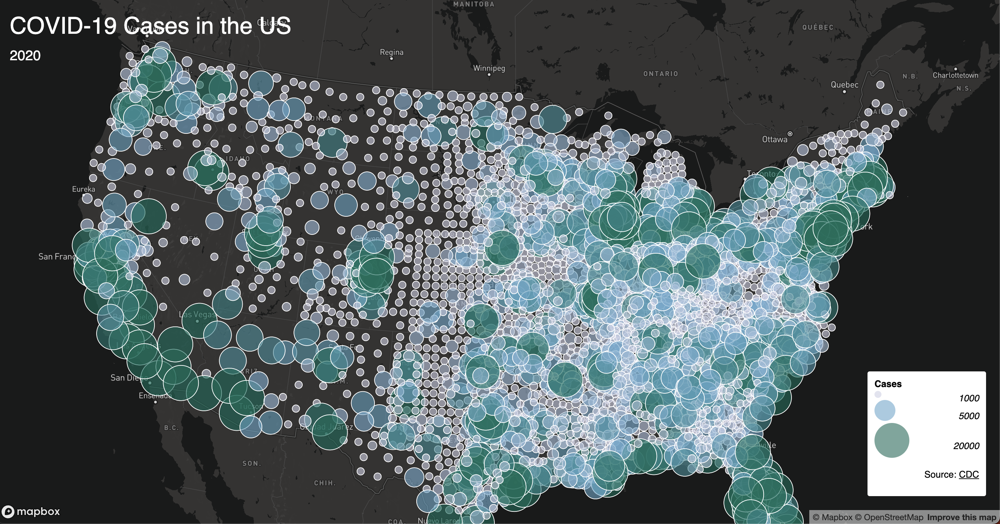
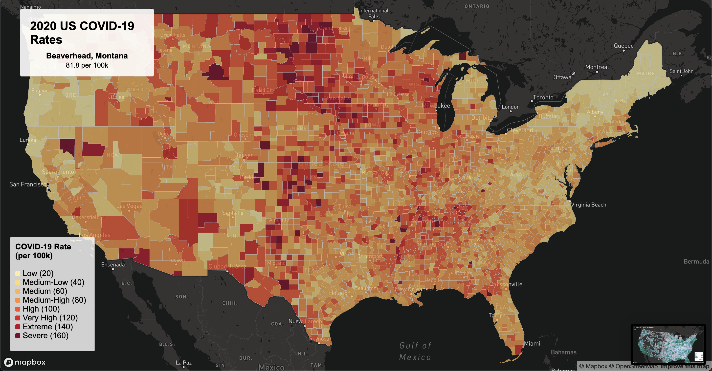

# US COVID-19 Rates Choropleth Map

## Project Overview
This project visualizes county-level COVID-19 rates across the United States for the year 2020 using an **interactive choropleth map**. The map is designed to help users explore the geographic distribution of COVID-19 cases per 100,000 people, highlighting regions with higher or lower rates.  

The map uses an **Albers Equal Area projection** for accurate area representation across the US. Users can hover over counties to see detailed information about the county, state, and COVID-19 rate.

## Live Map
You can view the interactive map here:  
[\[Map 1 Pages\]](https://jonnyjs2.github.io/458lab3/map1.html)
[\[Map 2 Pages\]](https://jonnyjs2.github.io/458lab3/map2.html)
## Screenshots

## Primary Functions
- **Interactive Choropleth**: Counties are colored according to COVID-19 rates per 100k.
- **Hover Info**: When hovering over a county, a tooltip displays the county name, state, and COVID-19 rate.
- **Legend**: The map includes a color-coded legend to interpret rates.
- **Custom Projection**: Uses the Albers Equal Area projection to maintain accurate relative area across the US — this projection handling was not covered in lectures.

## Libraries and Tools Used
- [Mapbox GL JS](https://docs.mapbox.com/mapbox-gl-js/) – interactive mapping and choropleth rendering
- JavaScript / HTML / CSS – frontend functionality and styling
- [GeoJSON](https://geojson.org/) – spatial data format for county boundaries
- Mapbox Studio Styles – for base map styling

## Data Sources
- **US COVID-19 County Data (2020)** – obtained from [NY Times COVID-19 Dataset](https://github.com/nytimes/covid-19-data)
- **US Counties Boundaries** – obtained from [US Census Bureau GeoJSON](https://www.census.gov/geographies/mapping-files/time-series/geo/carto-boundary-file.html)

## Credit and Acknowledgment
- Mapbox for providing the mapping platform
- NY Times and US Census Bureau for COVID-19 and geographic data
- Project inspired by class mapping exercises in [Your Course Name]

## How to Use
1. Clone or download this repository.
2. Open `map1.html` or `map2.html`in a web browser.
3. Hover over counties to see detailed COVID-19 rate information.

